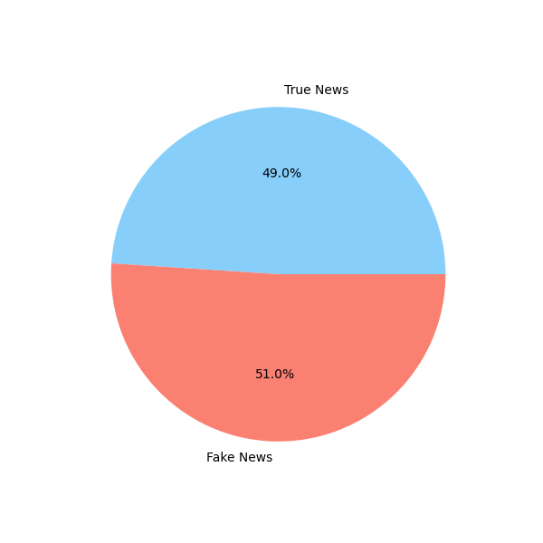
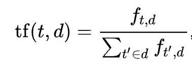
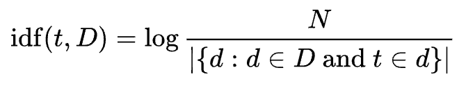
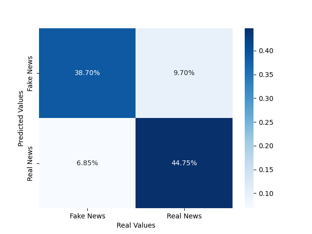
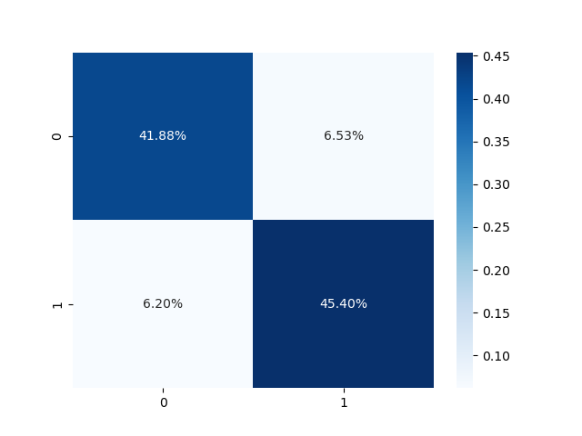
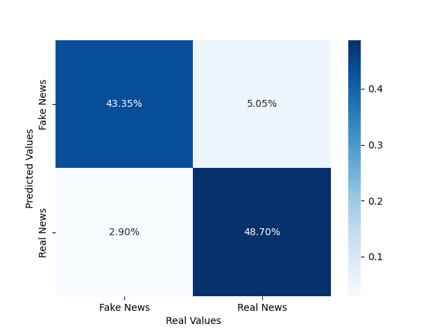

# FakeNewsClassification

In today's world one of the most prevalent issues is the presence of Fake News across all platforms of media: television, social media, word-of-mouth, and internet.  Combatting fake news is a monumental task, especially in the age of the internet where one lie can set off a domino effect.  The goal of this Repository is to make an attempt at identifying fake news articles from articles that I scraped from online sources, including online news webpages (like the ) using the Beatiful Soup API.  However, due to the large volume of data necessary for this task I also supplemented my relatively small dataset (1,000 articles) with others gathered online from multiple sources to obtain a much larger ~70,000 dataset, that is gigabytes in size.  

The primary goal of this project was to implement NLP processes and ML/AI algorihtms to predict whether the news articles that I collected, which are often a part of my own media diet, are real news and fake news.  While this project may be small, it will demonstrate my ability to use NLP practices to solve real-world applicable issues, that are very pertinint today.  It then extended beyond my own media diet, as this was not a problem that only impacts me but society as a whole.  To this end, this repository is structured as follows: 

1. Data Exploration
2. Cleaning the Data (Stopwords, Lemmatization, Tokenization) 
3. Applied Machine Learning Algorithms
4. Results
5. Conclusions

## Data Exploration ##

As mentioned previously there are 70,000 articles in the set I was able to accumulate.  However, the data that I am using for this work is unfortunately too large to store on Github, so I will explain the structure here.  

These data are structured as: 
  1. Title
  2. Text
  3. Label (0 for fake, 1 for real) 

In this figure I show the percentage of real news (blue) versus fake news (red) in a pie chart.  There are slightly more fake news articles than there are real news articles, however there is not an imbalance which require a package like SMOTE.  Often times when dealing with such datasets I found that the data would be imbalanced with either more fake news or more real news.  During my collection, since a large portion of my scraping was done on accreddited news organizations, I found substantially more real news articles than fake news articles.  Other datasets had the opposite issues.

In this next figure, I go into a deeper dive into the actual data that I will be training on: the text.  The main goal of this project is to create classifiers which can distinguish between real and fake news, and potentially on the easiest ways to possible discrinimate them is to find the number of words in each article.  In the figures below I show the distribution of the number of words in the text and in the title.  

## Cleaning the Data (Stopwords, Lemmatization, Tokenization) ##

The first step of the cleaning process is to remove numeric, punctuation, emojis, and accented characters since in English grammar they do not yield much significance to the meaning of a sentence.  While they can give context, the computer will not understand how to deal with these situations for this particular class of problem. I replaced all these other non-alphabetic characters into spaces (using regular expressions).  I then converted all the alphabetical characters into lower-case as well, so as to not have the same word appear multiple times with different weights due to upper/lower case differences.   And in essence our training/test data sets will constitute of news articles simply with lower cased words.  

I then implemented a standard NLP procedure that includes 3 major steps (all of these processes make use of the [NLTK Library](https://pythonspot.com/nltk-stop-words) ):
  1. Removing stopwords: Stop words like "a", "the", "in", etc.  These words generally are very high frequency words, and this frequency leads to very little meaning when this word is coupled with their "environments".  For example in this sentence, the words "for" and "the" hold very little meaning, and should we get rid of them, this sentence should largely be understood by the machine
  2. Lemmatization: Lemmatization is the process by which an NLP algorithm converts adverbs, adjectives, and other grammatical categories into "their" base worlds.  For example in the world "lovely" the base word is "love", indicative of a positive sentiment.  However, the suffix "-ly" simply denotes a different grammatical use of the word "love".  In short lemmatizing sorts words by grouping inflected or variant forms of the same word.  For the purposes of this work, I used the WordNetLemmatizer
  3. Vectorization: we then convert the words into numbers, since computers cannot "read" in the same ways humans do.  The vectorization process allows the ML/AI models that we will use below to read in the vectors, which represent the text they were derived from.  However, we also must ensure that these vectors are of standard length, so as to simplify the reading process.  To implement this I limit the number of elements in each given vector (in essence selecting the number of words after removing the stopwords and lemmatizing to be sent into our training models).  I will go into more detail about the vectorization process in the next section.  

## Applied Machine Learning Algorithms ##

## TF-IDF ##
I first tested an term frequency–inverse document frequency (TF-IDF) vectorization methodology.  In this methodology we vectorize the text by taking the inverse frequency of a word in a document (or in our case a sub-sample of our documents).  

In essence, the more rare a word is in the document(s) the more weight it is given when it is being applied to NLP and LLM.  Hence, words that are more common in a vernacular (like in this repo the word "words" appears many times) will have lower weights when compared to words that used less commonly ("like galaxies" or "bombastic").  

### Naive Bayes Classifier ### 

Naive Bayes are a family of models which attempt to connect the label to the properties given in a features/variables set.  It utilizes the Naive Bayes assumption: 

$$ \mathrm{Posterior} \propto \mathrm{Likelihood} \times \mathrm{prior} $$

The primary driver to use a Naive Bayes (NB) Classifier is because of it's ease of simplicity and relatively interperability.  The Naive Bayes classifier attempts to calculate the probability of observing a set of features given a label (likelihood), and the probability of observing that label (prior).  However, the term Naive comes from the assumption that each feature is independent of all the other features, which may not be an accrute describer for the problem that we are using (however this is for illustrative purposes), since this is an NLP problem, and this includes grammar.  In this Repo I have used a multinomial NB classifier, however, in the future I will intend to use a Bernoulli NB since this is a binary classification problem.  

### Decision Tree Classifier ### 
A decision tree classifier, most simply creates a tree which splits the data based on some characteristic that maximizes a given score (like Gini or entropy), and ends when it reaches some stopping criteria, which could be all the elements in a branch have the same label (i.e. all the labels in a leaf node will be the same), or we have reached the limit in the number of branches we are allowed.  

The decision tree is useful for classifying Fake News as grammar is a non-linear system.  In addition, due to the relatively simple nature of this problem, decision trees are adept at handling [EDIT]. 

However, some weaknesses of decision trees include the instability (small changes in the data can change how a node makes decision) and relatively inaccurate since there is only a single decision tree being constructed.  Another issue is overfitting the data, especially if hte depth of the trees becomes too large, where it can train well, but on test data perform poorly.  

### Random Forest Classifier ###

Random forests are an example of ensemble models, in which there is an ensemble of decision trees being constructed to classify our news articles.  The nature of averaging over multiple trees reduces the impacts of overfitting, as averaging over the ensemble of different reduces the variance in classifications in a single tree.  This is done through a process called "bagging" where multiple subsamples are drawn and trained over. Ultimately, the prediction that is ultimately made is one that is "democratically" chosen after aggregating all the trees together.   

### XGBoost Classifier ###
XGBoost stands for "Extreme Gradient Boosting”, and the method by which this works is it takes previous classifiers and implemented corrections to more accurately create predictions/classifications.  Gradient boosting is accomplished by combining multiple trees sequentially (rather than serially as in the random forest).  Corrections are then made to opimtimize the training weights until the maximum number of steps have been achieved, or the results have converged such that the changes in the gradient are very small.  These are all tunable hyperparameter (for which I have tested for).  For a more in depth analysis of XGBoost see [this link](https://xgboost.readthedocs.io/en/stable/tutorials/model.html).

## Results ## 

### Naive Bayes Classifier ### 

In this section, I show the confusion matrices of the ML/AI methods that I talked about above.  The x-axis represents .  In all of these plots I plot the "True Positive" rates in the upper left, "False Positive" in the upper right (Type I), "True negatives" in the lower right, and "False Negative" (Type II) in the lower left.  Positive (0) represents the case in which an article is fake news, while Negative (1) is an article that is real news.  

I foud that NB yielded the least accurate results, however this intuitively tracks, as the NB classifier attempts to correlate each label to each individual document, and tries to create a predictve pattern based on Bayes's rule (see above).  

### Decision Tree Classifier ### 

The decision tree classifier is the second least accurate, however again this is largely intuitive as we are dealing with a single decision tree.  I attempted to optimize the hyperparameters of the tree (like the number of levels the tree could have), and this was the best that I could achieve with this method.  The underlying issue, is the single decision tree, and likely minor differences in documents can incorrectly classify.  However, this method does substantially better than the NB classifier. Addtiionally, the nature of this specific problem is well suited to decision trees and will like be even more accurate in cases where we use an ensemble trees or allow the tree to evolve based off incorrect classification.  

### Random Forest Classifier ###

The random forest and XGBoost classifiers do even better than the decision because they inherently address the underlying weaknesses of the decision tree model (although these results are much more difficult to intuit).  In essence these results perform more adequately than the Decision Tree Classifier alone, likely because they overcome the issues of overfitting (Random Forest), as well as making sequential corrections to the training process.  These classifications achieved 92% and 95% accuracy. One thing of particular note however is that the random forest classifier is has a larger "False Positive" rate than "False Negative" rate, while XGBoost has roughly equal Type I and Type II errors.  The random forest preferentially seems to miscategorize real news articles as fake articles, however a scenario such as classifying fake news articles, more skepticism of fake news is likely to be more beneficial than mischaracterizing fake news as real news.  This could prevent the propagation of fake news and misinformation throughout the internet.  

### XGBoost Classifier ###

## Conclusions and Future Work ##

In the future I aim to implememnt neural network and comparing my models to those made by BERT.  This is currently in process as you can see from [this file](./multInOuput_ClassifyDataset.py) and [this file](./BERT_ClassifyDataset.py) scripts.  
