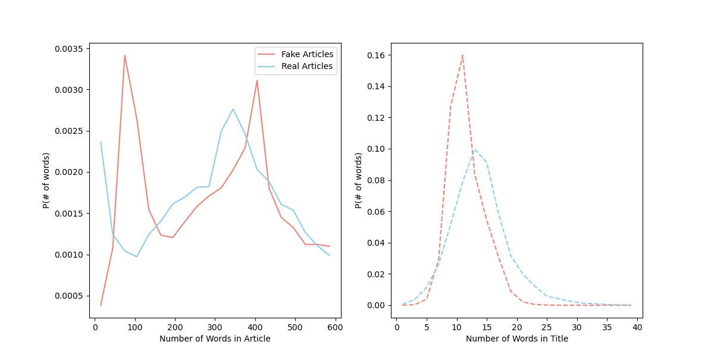

# FakeNewsClassification

In today's world one of the most prevalent issues is the presence of Fake News across all platforms of media: television, social media, word-of-mouth, and internet.  Combatting fake news is a monumental task, especially in the age of the internet where one lie can set off a domino effect.  The goal of this Repository is to make an attempt at identifying fake news articles from articles that I scraped from online sources, including online news webpages (like the ) using the Beatiful Soup API.  However, due to the large volume of data necessary for this task I also supplemented my relatively small dataset (1,000 articles) with others gathered online from multiple sources to obtain a much larger ~70,000 dataset, that is gigabytes in size.  

The primary goal of this project was to implement NLP processes and ML/AI algorihtms to predict whether the news articles that I collected, which are often a part of my own media diet, are real news and fake news.  While this project may be small, it will demonstrate my ability to use NLP practices to solve real-world applicable issues, that are very pertinint today.  It then extended beyond my own media diet, as this was not a problem that only impacts me but society as a whole.  To this end, this repository is structured as follows: 

1. Data Exploration
2. Cleaning the Data (Stopwords, Lemmatization, Tokenization) 
3. Applied Machine Learning Algorithms
4. Results
5. Conclusions

## Data Exploration ##

As mentioned previously there are 70,000 articles in the set I was able to accumulate.  However, the data that I am using for this work is unfortunately too large to store on Github, so I will explain the structure here.  

These data are structured as: 
  1. Title
  2. Text
  3. Label (0 for fake, 1 for real) 

In this figure I show the percentage of real news (blue) versus fake news (red) in a pie chart.  There are slightly more fake news articles than there are real news articles, however there is not an imbalance which require a package like SMOTE.  Often times when dealing with such datasets I found that the data would be imbalanced with either more fake news or more real news.  During my collection, since a large portion of my scraping was done on accreddited news organizations, I found substantially more real news articles than fake news articles.  Other datasets had the opposite issues.

In this next figure, I go into a deeper dive into the actual data that I will be training on: the text.  The main goal of this project is to create classifiers which can distinguish between real and fake news, and potentially on the easiest ways to possible discrinimate them is to find the number of words in each article.  In the figures below I show the distribution of the number of words in the text and in the title.  

## Cleaning the Data (Stopwords, Lemmatization, Tokenization) ##

I then implemented a cleaning method that involved 3 major steps (all of these processes make use of the [NLTK Library](https://pythonspot.com/nltk-stop-words) ):
  1. Removing stopwords: Stop words like "a", "the", "in", etc.  These words generally are very high frequency words, and this frequency leads to very little meaning when this word is coupled with their "environments".  For example in this sentence, the words "for" and "the" hold very little meaning, and should we get rid of them, this sentence should largely be understood by the machine
  2. Lemmatization: Lemmatization is the process by which an NLP algorithm converts adverbs, adjectives, and other grammatical categories into "their" base worlds.  For example in the world "lovely" the base word is "love", indicative of a positive sentiment.  However, the suffix "-ly" simply denotes a different grammatical use of the word "love".  In short lemmatizing sorts words by grouping inflected or variant forms of the same word.  For the purposes of this work, I used the WordNetLemmatizer
  3. Vectorization: we then convert the words into numbers, since computers cannot "read" in the same ways humans do.  The vectorization process allows the ML/AI models that we will use below to read in the vectors, which represent the text they were derived from.  However, we also must ensure that these vectors are of standard length, so as to simplify the reading process.  To implement this I limit the number of elements in each given vector (in essence selecting the number of words after removing the stopwords and lemmatizing to be sent into our training models).  
## Applied Machine Learning Algorithms ##
I first tested an term frequency–inverse document frequency (TF-IDF) vectorization methodology.  In this methodology the 
## Results ## 

### Naive Bayes Classifier ### 

Naive Bayes are a family of models which attempt to connect the label to the properties given in a features/variables set.  It utilizes the Naive Bayes assumption: 

$$ \mathrm{Posterior} \propto \mathrm{Likelihood} \times \mathrm{prior} $$

The primary driver to use a Naive Bayes (NB) Classifier is because of it's ease of simplicity and relatively interperability.  The Naive Bayes classifier attempts to calculate the probability of observing a set of features given a label (likelihood), and the probability of observing that label (prior).  However, the term Naive comes from the assumption that each feature is independent of all the other features, which may not be an accrute describer for the problem that we are using (however this is for illustrative purposes), since this is an NLP problem, and this includes grammar.  In this Repo I have used a multinomial NB classifier, however, in the future I will intend to use a Bernoulli NB since this is a binary classification problem.  

### Decision Tree Classifier ### 
A decision tree classifier, most simply creates a tree which splits the data based on some characteristic that maximizes a given score, and ends when it reaches some stopping criteria, which could be all the elements in a branch have the same label (i.e. all the labels in a leaf node will be the same), or we have reached the limit in the number of branches we are allowed.  

### Random Forest Classifier ###

### XGBoost Classifier ###

## Conclusions and Future Work ##
